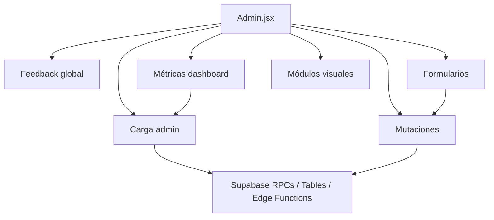

# Plan de Refactor Progresivo Admin KUPAN

Fecha: 2026-06-30  
Archivo medido: `src/pages/Admin.jsx`  
Objetivo: reducir responsabilidades de `Admin.jsx` sin cambiar contratos Supabase, UI aprobada ni comportamiento actual.

## Fase 1 — Medición del Archivo

| Métrica | Resultado |
| --- | ---: |
| Líneas totales | 2501 |
| `useState` | 28 |
| `useEffect` | 5 |
| `useMemo` | 16 |
| `useRef` | 9 |
| Formularios JSX | 9 |
| Secciones visuales por `activeSection` | 12 |
| Llamadas `.rpc()` | 9 |
| Llamadas `.from()` | 10 |
| Menciones `supabase.` | 22 |
| Funciones `async function` | 25 |
| Funciones totales aproximadas | 54 |

## Funciones de Consulta

Funciones relacionadas con consulta/carga:

- `runAdminLoader`
- `loadAdminData`
- `refreshData`
- `ensureFreshAdmin`

Notas:

- `loadAdminData` ya usa `Promise.allSettled`, lo cual es correcto para errores parciales.
- `refreshData` mezcla carga, feedback, estado de settings, cumpleaños y actualización global.
- El siguiente paso seguro es mover `adminLoaders`, `runAdminLoader` y `loadAdminData` a un hook sin tocar las mutaciones.

## Mutaciones Detectadas

Mutaciones o acciones con escritura:

1. `savePlan`
2. `togglePlan`
3. `saveMembership`
4. `saveMembershipEdit`
5. `updateMembershipStatus`
6. `renewMembership`
7. `extendMembershipSevenDays`
8. `adjustMembershipTokens`
9. `saveWod`
10. `saveSchedule`
11. `toggleSchedule`
12. `savePost`
13. `togglePost`
14. `saveTexts`
15. `updateReservationStatus`
16. `saveManualReservation`
17. `simulateApprovedPayment`
18. `createStudent`

Acciones auxiliares no críticas:

- `copyCredentials`
- `copyBirthdayGreeting`

## Formularios Detectados

1. Crear alumno.
2. Planes.
3. Activar membresía.
4. Editar membresía.
5. Reserva manual.
6. WOD.
7. Horarios.
8. Comunidad / publicación.
9. Textos principales.

## Secciones Visuales

Secciones controladas por `activeSection`:

- `overview`
- `create-student`
- `students`
- `plans`
- `memberships`
- `reservations`
- `wod`
- `schedule`
- `community`
- `texts`
- `birthdays`
- `prs`

## Funciones con Más de 50 Líneas

| Función | Líneas | Responsabilidad principal |
| --- | ---: | --- |
| `AdminSidebar` | 68 | Navegación lateral, estado activo, módulos colapsables. |
| `saveMembership` | 77 | Validación, cálculo de tokens, activación de membresía, feedback y recarga. |
| `saveMembershipEdit` | 64 | Validación, actualización avanzada de membresía, feedback y recarga. |
| `createStudent` | 52 | Validación, llamada Edge Function, credenciales temporales, feedback y recarga. |

## Funciones con Demasiadas Responsabilidades

### `refreshData`

Responsabilidades mezcladas:

- Ejecutar carga global.
- Manejar loading.
- Manejar feedback.
- Actualizar `adminData`.
- Actualizar errores por sección.
- Actualizar `lastUpdated`.
- Hidratar `textDraft`.
- Cargar próximos cumpleaños con otra utilidad.

Extracción recomendada:

- `useAdminData.reloadAll()`
- `useAdminFeedback.showSuccess/showError`
- Helper `mapSettingsToTextDraft`

### `saveMembership`

Responsabilidades mezcladas:

- Validación formulario.
- Cálculo de tokens.
- Validación plan ilimitado.
- Payload RPC.
- Manejo de error.
- Feedback.
- Recarga.

Extracción recomendada:

- Helper puro `buildMembershipActivationPayload`
- Hook futuro `useAdminMemberships.activateMembership`

### `saveMembershipEdit`

Responsabilidades mezcladas:

- Validación formulario.
- Normalización por plan Full.
- Payload RPC.
- Manejo de error real.
- Feedback.
- Recarga.

Extracción recomendada:

- Helper puro `buildMembershipUpdatePayload`
- Hook futuro `useAdminMemberships.updateMembership`

### `Admin`

Responsabilidades actuales:

- Autorización.
- Carga de datos.
- Feedback.
- Cálculos del dashboard.
- Filtros.
- Mutaciones.
- Formularios.
- Renderizado de todas las secciones.

Objetivo progresivo:

- Dejar `Admin` como coordinador de hooks y módulos presentacionales.

## Estados Compartidos Entre Secciones

Estados usados por más de un módulo:

- `adminData`
- `message`
- `messageType`
- `isLoading`
- `sectionErrors`
- `lastUpdated`
- `studentQuery`
- `studentFilter`
- `activeMembershipByProfile`
- `latestMembershipByProfile`
- `filteredProfiles`
- `activeSection`
- `pendingFocusTarget`

Estos estados deben migrarse con cuidado porque varias secciones dependen de ellos.

## Estados Propios de Módulo

Estados que pertenecen a un dominio específico:

- Planes:
  - `planDraft`
- Membresías:
  - `membershipDraft`
  - `membershipEditDraft`
- WOD:
  - `wodDraft`
- Horarios:
  - `scheduleDraft`
- Comunidad:
  - `postDraft`
- Crear alumno:
  - `studentDraft`
  - `createdCredentials`
  - `isCreatingStudent`
- Reserva manual:
  - `manualReservationDraft`
  - `isSavingManualReservation`
- Configuración/textos:
  - `textDraft`
- Navegación Admin:
  - `openModules`
  - `isSidebarCollapsed`
  - `globalQuery`
  - `dismissedAlertIds`

## Dependencias Compartidas

Internas:

- `supabase`
- `isSupabaseConfigured`
- `getCurrentSupabaseUser`
- `adminReserveForStudent`
- `defaultAppText`
- `saveAppSetting`
- `loadUpcomingBirthdays`
- `buildBirthdayGreeting`
- `formatBirthdayDayMonth`
- `getHumanErrorMessage`
- `logAppError`

Componentes:

- `SectionTitle`
- Componentes admin en `src/components/admin/AdminDashboard.jsx`

## Mapa de Dependencias

## Orden Seguro de Extracción

### Etapa 1: Constantes y Helpers Puros

Riesgo: bajo.

Extraer:

- `adminNavigationModules`
- `adminSectionMeta`
- `emptyPlan`
- `emptyMembership`
- `emptyMembershipEdit`
- `emptyWod`
- `emptySchedule`
- `emptyPost`
- `emptyStudent`
- `emptyManualReservation`
- `settingKeys`
- `studentFilters`
- `weekdayLabels`
- Helpers:
  - `formatDate`
  - `getChileDateString`
  - `formatMoney`
  - `toTime`
  - `addDays`
  - `calculateDaysBetween`
  - `getPlanTokenTotal`
  - `getMembershipTokens`
  - `getChileDayOfWeek`
  - `getAdminModuleId`
  - `getDateTimeValue`

Archivos sugeridos:

- `src/config/adminNavigation.js`
- `src/constants/adminConstants.js`
- `src/utils/adminFormatters.js`
- `src/utils/adminMetrics.js`

Pruebas sugeridas:

- Fechas y zona horaria.
- Tokens de membresía Full/tokenizada.
- Vencimientos.
- Día de semana Chile.

### Etapa 2: Hook `useAdminData`

Riesgo: medio.

Extraer:

- `emptyAdminData`
- `adminLoaders`
- `runAdminLoader`
- `loadAdminData`
- Estados:
  - `adminData`
  - `isLoading`
  - `lastUpdated`
  - `sectionErrors`

Debe mantener:

- Carga parcial con `Promise.allSettled`.
- Errores por sección.
- Reintento global.
- Reintento por sección en etapa posterior.

### Etapa 3: Hook `useAdminFeedback`

Riesgo: bajo.

Extraer:

- `message`
- `messageType`
- Helpers:
  - `showSuccess`
  - `showError`
  - `showInfo`
  - `clearFeedback`

### Etapa 4: Componentes Presentacionales por Módulo

Riesgo: medio.

Extraer una sección por vez:

1. `AdminOverviewModule`
2. `AdminStudentsModule`
3. `AdminPlansModule`
4. `AdminWodModule`
5. `AdminScheduleModule`
6. `AdminCommunicationsModule`
7. `AdminMembershipsModule`
8. `AdminReservationsModule`
9. `AdminSettingsModule`

Regla:

- Las mutaciones siguen en `Admin.jsx` al inicio.
- Los componentes reciben callbacks.

### Etapa 5: Formularios

Riesgo: medio.

Extraer formularios uno a uno. Orden recomendado:

1. `AdminWodForm` por ser contenido aislado.
2. `AdminScheduleForm`.
3. `AdminCommunityPostForm`.
4. `AdminSettingsForm`.
5. `AdminManualReservationForm`.
6. `AdminMembershipForm`.
7. `AdminCreateStudentForm`.

### Etapa 6: Hooks de Mutación por Dominio

Riesgo: alto.

Extraer al final:

- `useAdminWod`
- `useAdminSchedule`
- `useAdminCommunications`
- `useAdminReservations`
- `useAdminMemberships`
- `useAdminStudents`
- `useAdminSettings`

Cada hook debe preservar nombres exactos de RPC y payload.

### Etapa 7: Borrador WOD

Riesgo: medio.

Implementar después de extraer `AdminWodForm`, usando clave:

- `kupan_admin_wod_draft_v1`

Reglas:

- No reemplazar WOD Supabase automáticamente.
- Pedir confirmación para recuperar.
- Borrar solo tras guardado exitoso.

## Riesgos Principales

- Cambiar payloads de RPC accidentalmente.
- Romper dependencias cruzadas entre `filteredProfiles`, membresías y reservas.
- Duplicar mutaciones por doble clic si se extraen hooks sin estado `isSubmitting`.
- Perder mensajes de error reales si se centraliza feedback demasiado pronto.
- Introducir stale state si `useAdminData` no ignora respuestas tras desmontar.

## Criterio para Continuar a Fase 2

- Este documento existe.
- El proyecto compila sin cambios funcionales.
- `npm run lint`, `npm test` y `npm run build` pasan.
- No hay cambios de comportamiento en Admin.

## Resultado Etapa 1

Estado: completada.

Alcance aplicado:

- Se extrajo la navegación admin a `src/config/adminNavigation.js`.
- Se extrajeron factories de formularios, filtros y etiquetas a `src/constants/adminConstants.js`.
- Se extrajeron formateadores puros a `src/utils/adminFormatters.js`.
- Se extrajeron cálculos puros a `src/utils/adminMetrics.js`.
- Se agregaron pruebas unitarias para helpers y constantes en `src/utils/adminUtilities.test.js`.

Medición:

- `src/pages/Admin.jsx` antes: 2501 líneas.
- `src/pages/Admin.jsx` después: 2270 líneas.
- Reducción: 231 líneas.

Garantías de esta etapa:

- No se modificaron contratos de Supabase.
- No se cambiaron nombres de RPC.
- No se cambió la lógica principal de reservas, tokens, membresías ni alumnos.
- No se avanzó a extracción de hooks, mutaciones ni formularios.

Comportamiento preservado:

- Misma navegación visible por módulos.
- Mismos IDs de secciones.
- Mismos drafts iniciales para formularios admin.
- Mismos formatos visibles para fechas, horas y montos en los casos válidos.
- Misma lógica de tokens, cupos y vencimientos usada por el panel.

Riesgos encontrados:

- Algunos accesos de navegación apuntan a la misma sección con distinto `target` interno. Se mantuvo ese comportamiento porque permite accesos rápidos al mismo módulo sin crear rutas nuevas.
- Los helpers de fecha dependen de `America/Santiago` cuando corresponde a operación KUPAN. Se agregaron pruebas para evitar cambios por UTC.
- `Admin.jsx` sigue concentrando estado, mutaciones y formularios. Eso queda reservado para etapas posteriores.

Elementos deliberadamente no extraídos:

- `useAdminData`.
- Mutaciones de Supabase.
- Formularios admin.
- Componentes internos con dependencia fuerte de estado React.
- Contratos RPC, payloads, RLS o estructura de tablas.

## Resultado Etapa 2

Estado: completada.

Alcance aplicado:

- Se creó `src/hooks/admin/useAdminData.js`.
- Se trasladó la lectura administrativa global desde `Admin.jsx` al hook.
- Se trasladaron `emptyAdminData`, `adminLoaders`, `runAdminLoader` y la carga con `Promise.allSettled`.
- Se agregó `reloadAll` para recarga global con errores parciales.
- Se agregó `reloadSection` para reintento individual por sección.
- Se agregó `updateSectionData` como salida controlada del hook, aunque `Admin.jsx` no la usa todavía.
- Se protegió `textDraft` para no pisar cambios locales no guardados durante recargas.
- Se agregaron pruebas en `src/hooks/admin/useAdminData.test.js`.

API del hook:

- `data`
- `isLoading`
- `isRefreshing`
- `sectionLoading`
- `sectionErrors`
- `lastUpdated`
- `reloadAll`
- `reloadSection`
- `updateSectionData`

Loaders trasladados:

- `profiles` -> `admin_get_profiles`
- `plans` -> `admin_get_plans`
- `memberships` -> `admin_get_memberships`
- `reservations` -> `admin_get_reservations`
- `wod` -> `admin_get_wod`
- `schedule` -> `admin_get_schedule`
- `posts` -> `admin_get_community_posts`
- `settings` -> `admin_get_app_settings`
- `birthdays` -> `birthdays_this_month`
- `prs` -> `admin_get_personal_records`
- `tokenMovements` -> `admin_get_token_movements`
- `upcomingBirthdays` -> `loadUpcomingBirthdays(30)`

Medición:

- `src/pages/Admin.jsx` antes de Etapa 2: 2270 líneas.
- `src/pages/Admin.jsx` después de Etapa 2: 2207 líneas.
- `src/hooks/admin/useAdminData.js`: 323 líneas.
- Reducción neta de `Admin.jsx`: 63 líneas.

Estados trasladados desde `Admin.jsx`:

- `adminData`
- `isLoading`
- `lastUpdated`
- `sectionErrors`

Estados nuevos centralizados en el hook:

- `isRefreshing`
- `sectionLoading`

Comportamiento preservado:

- Misma carga parcial por sección.
- Mismos nombres de RPC.
- Mismos datos reales desde Supabase.
- Mismas mutaciones en `Admin.jsx`.
- Misma UI general del panel.

Riesgos encontrados:

- Las mutaciones siguen llamando recarga global por seguridad. La recarga fina por sección queda para una etapa futura.
- `refreshData` sigue manejando feedback visual en `Admin.jsx`, como estaba planificado.
- `textDraft` sigue en `Admin.jsx`; solo se protegió contra sobrescritura accidental.

Elementos deliberadamente no extraídos:

- `useAdminFeedback`.
- Mutaciones Supabase.
- Formularios.
- Módulos visuales.
- Contratos RPC, payloads, RLS o tablas.

## Resultado Etapa 3

Estado: completada.

Alcance aplicado:

- Se creó `src/hooks/admin/useAdminFeedback.js`.
- Se migraron `message` y `messageType` desde estado local de `Admin.jsx` al hook.
- Se agregaron `showSuccess`, `showError`, `showInfo`, `showWarning` y `clearFeedback`.
- Se centralizó la cancelación de temporizadores y prevención de actualizaciones tras desmontaje.
- Se evitó feedback duplicado usando `refreshData({ silent: true })` después de mutaciones que ya muestran su propio mensaje.
- Se agregó manejo de error para copiado al portapapeles.
- Se agregaron pruebas en `src/hooks/admin/useAdminFeedback.test.js`.

API del hook:

- `feedback`
- `message`
- `messageType`
- `showSuccess`
- `showError`
- `showInfo`
- `showWarning`
- `clearFeedback`

Tipos admitidos:

- `success`
- `error`
- `info`
- `warning`

Comportamiento de limpieza:

- Por compatibilidad con el comportamiento existente, los mensajes no se limpian automáticamente por defecto.
- El hook soporta `autoDismiss` y `duration` para mensajes temporales cuando se requiera.
- Los errores permanecen visibles salvo limpieza manual o reemplazo controlado.

Medición:

- `src/pages/Admin.jsx` antes de Etapa 3: 2207 líneas.
- `src/pages/Admin.jsx` después de Etapa 3: 2179 líneas.
- `src/hooks/admin/useAdminFeedback.js`: 169 líneas.
- Reducción neta de `Admin.jsx`: 28 líneas.

Patrones eliminados:

- `setMessage(...)`: 0 restantes.
- `setMessageType(...)`: 0 restantes.

Comportamiento preservado:

- Mismos textos principales de feedback.
- Misma UI del bloque de mensaje.
- Mismas mutaciones en `Admin.jsx`.
- Mismos contratos Supabase.

Riesgos encontrados:

- `warning` e `info` comparten la representación visual existente del mensaje global porque no se rediseñó el componente.
- `showInfo` queda disponible en la API aunque `Admin.jsx` no lo necesita todavía.

Elementos deliberadamente no extraídos:

- Componentes visuales.
- Formularios.
- Mutaciones por dominio.
- `useAdminData`.
- Contratos RPC, payloads, RLS o tablas.

## Resultado Etapa 4

Estado: completada.

Alcance aplicado:

- Se creó `src/components/admin/AdminUi.jsx` para componentes visuales reutilizados.
- Se creó `src/components/admin/modules/` con 12 módulos presentacionales.
- Se reemplazaron las secciones inline de `Admin.jsx` por módulos según `activeSection`.
- Se mantuvieron en `Admin.jsx` todos los estados de formulario, refs, mutaciones y validaciones.
- Se agregó `src/components/admin/modules/adminModules.test.js` como validación estática de arquitectura.

Módulos creados:

- `AdminOverviewModule`
- `AdminCreateStudentModule`
- `AdminStudentsModule`
- `AdminPlansModule`
- `AdminMembershipsModule`
- `AdminReservationsModule`
- `AdminWodModule`
- `AdminScheduleModule`
- `AdminCommunicationsModule`
- `AdminSettingsModule`
- `AdminBirthdaysModule`
- `AdminPersonalRecordsModule`

Medición:

- `src/pages/Admin.jsx` antes de Etapa 4: 2179 líneas.
- `src/pages/Admin.jsx` después de Etapa 4: 1503 líneas.
- Reducción neta de `Admin.jsx`: 676 líneas.

Comportamiento preservado:

- Mismos formularios visibles.
- Mismos handlers de guardado.
- Mismos refs para scroll/focus.
- Mismos filtros y cálculos.
- Mismos contratos Supabase.
- Misma UI aprobada.

Validación agregada:

- Ningún módulo importa Supabase.
- Ningún módulo ejecuta `.rpc()`.
- Ningún módulo ejecuta `.from()`.
- Ningún módulo importa `useAdminData` ni `useAdminFeedback`.

Elementos deliberadamente no extraídos:

- Mutaciones por dominio.
- Hooks de formularios.
- Builders de payload.
- Contratos RPC.
- Tablas.
- Políticas RLS.
- Cambios de diseño.
- Etapa 6.

## Resultado Etapa 5

Estado: completada.

Alcance aplicado:

- Se creó `src/components/admin/forms/`.
- Se extrajeron 9 formularios controlados.
- Los módulos admin ahora delegan sus formularios a componentes específicos.
- Los drafts siguen en `src/pages/Admin.jsx`.
- Las mutaciones, validaciones de negocio, payloads, feedback y recargas siguen en `src/pages/Admin.jsx`.
- Se agregó validación estática en `src/components/admin/forms/adminForms.test.js`.

Formularios creados:

- `AdminWodForm`
- `AdminScheduleForm`
- `AdminCommunityPostForm`
- `AdminSettingsForm`
- `AdminManualReservationForm`
- `AdminPlanForm`
- `AdminMembershipActivationForm`
- `AdminMembershipEditForm`
- `AdminCreateStudentForm`

Medición:

- `src/pages/Admin.jsx` antes de Etapa 5: 1503 líneas.
- `src/pages/Admin.jsx` después de Etapa 5: 1503 líneas.
- La reducción ocurre en módulos presentacionales, no en el coordinador.

Módulos actualizados:

- `AdminWodModule`
- `AdminScheduleModule`
- `AdminCommunicationsModule`
- `AdminSettingsModule`
- `AdminReservationsModule`
- `AdminPlansModule`
- `AdminMembershipsModule`
- `AdminCreateStudentModule`

Validación agregada:

- Ningún formulario importa Supabase.
- Ningún formulario ejecuta `.rpc()`.
- Ningún formulario ejecuta `.from()`.
- Ningún formulario consume `useAdminData`.
- Ningún formulario consume `useAdminFeedback`.
- Ningún formulario usa `defaultValue`.

Elementos deliberadamente no extraídos:

- Ajuste de tokens como formulario independiente, porque no existe un bloque de formulario separado.
- Mutaciones por dominio.
- Hooks por dominio.
- Builders de payload.
- Contratos RPC.
- Tablas.
- Políticas RLS.
- Cambios de UI.
- Etapa 6.

## Resultado Etapa 6

Estado: completada.

Alcance aplicado:

- Se crearon hooks por dominio para WOD, horarios, comunicaciones, configuración, planes, alumnos, reservas y membresías.
- Se creó `src/hooks/admin/useAdminMutationState.js` para estado de operación y prevención de doble ejecución.
- Se creó `src/utils/adminMutationBuilders.js` para payloads puros.
- Se mantuvieron en `Admin.jsx` los wrappers de coordinación, feedback, drafts, validaciones, refs y navegación.
- Se creó `docs/admin-mutations-map.md`.

Hooks creados:

- `useAdminWod`
- `useAdminSchedule`
- `useAdminCommunications`
- `useAdminSettings`
- `useAdminPlans`
- `useAdminStudents`
- `useAdminReservations`
- `useAdminMemberships`

Mutaciones extraídas:

- `saveWod`
- `saveSchedule`
- `toggleSchedule`
- `savePost`
- `togglePost`
- `saveTexts`
- `savePlan`
- `togglePlan`
- `createStudent`
- `saveManualReservation`
- `updateReservationStatus`
- `saveMembership`
- `saveMembershipEdit`
- `updateMembershipStatus`
- `renewMembership`
- `extendMembershipSevenDays`
- `adjustMembershipTokens`
- `simulateApprovedPayment`

Medición:

- `src/pages/Admin.jsx` antes de Etapa 6: 1503 líneas.
- `src/pages/Admin.jsx` después de Etapa 6: 1439 líneas.

Validación:

- Los hooks de dominio no importan componentes visuales.
- Los hooks de dominio no muestran feedback.
- Los hooks de dominio no navegan.
- Los hooks devuelven resultados estructurados.
- Los wrappers de `Admin.jsx` coordinan feedback y recarga.

Elementos deliberadamente no extraídos:

- Drafts.
- Validaciones de negocio.
- Navegación.
- Refs y scroll.
- Prompt de ajuste de tokens.
- Feedback visual.
- Etapa 7.

## Resultado Etapa 7

Estado: completada.

Alcance aplicado:

- Se agregó un borrador local recuperable para el formulario WOD admin.
- Se usa exactamente la clave `kupan_admin_wod_draft_v1`.
- El borrador se guarda en `localStorage` solo cuando existe contenido significativo en campos del WOD.
- La fecha por sí sola no se considera contenido suficiente.
- La recuperación del borrador requiere acción explícita del admin.
- El descarte del borrador requiere acción explícita del admin.
- El borrador se elimina solo después de un guardado remoto exitoso en Supabase o descarte explícito.
- Los borradores vencen después de 14 días.
- Si el borrador local es idéntico al WOD remoto de la misma fecha, se limpia y no se ofrece recuperación.
- Se mantiene una sola clave con fecha interna para evitar múltiples fuentes locales.

Archivos creados:

- `src/hooks/admin/useAdminWodDraft.js`
- `src/utils/adminWodDraft.js`
- `src/utils/adminWodDraft.test.js`
- `docs/admin-wod-draft.md`

Archivos modificados:

- `src/pages/Admin.jsx`
- `src/components/admin/modules/AdminWodModule.jsx`
- `package.json`
- `docs/admin-refactor-plan.md`
- `docs/admin-refactor-result.md`

Comportamiento preservado:

- Supabase sigue siendo la persistencia definitiva del WOD.
- `useAdminWod` mantiene el mismo `upsert` con conflicto por `date`.
- No se cambiaron payloads.
- No se cambiaron tablas.
- No se cambiaron RPC.
- No se cambiaron políticas RLS.
- No se agregó sincronización automática.
- No se avanzó a Etapa 8.
